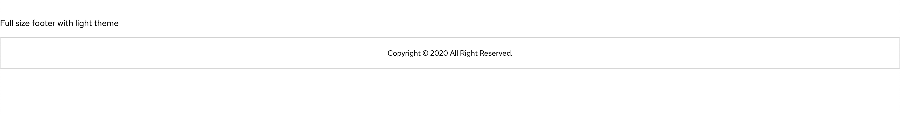
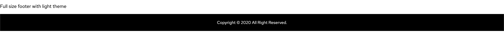
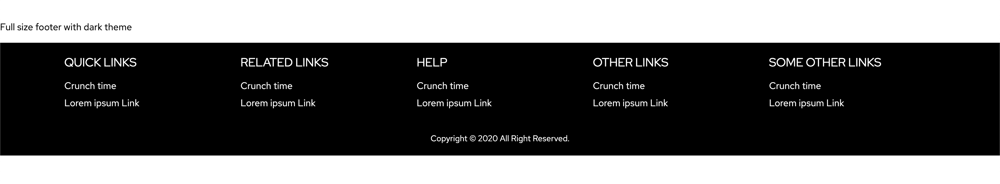

# This is opc-footer 👋


[](https://github.com/1-Platform/op-components/graphs/commit-activity)

opc-footer is a web component based on lit-element. By default it has the light theme and text for copyright.

## Install

```sh
npm install
```

## Usage

the opc-footer have supports dark theme, by default the light theme is selected. for example
footer with default theme:

```html
<opc-footer></opc-footer>
```



here's another with dark

```html
<opc-footer theme="dark"></opc-footer>
```



To add the links it has a attribute called opc-links-groups. this supports the Array folloing is the structure.

```js
[
  {
    name: "Example Group Link",
    links: [
      {
        name: "Crunch time",
        path: "https://example.com",
      },
      {
        name: "Lorem ipsum Link",
      },
    ],
  },
  ...
];
```
For a demo example see the



The Links with no path fires the custom event called footer-link-click, so the user can add
custom behaviors.

for example 
```js
  const myFooterElement = document.querySelector('opc-footer');
  myFooterElement.addEventListener('opc-footer-link-click', (e) => {
    console.log(e);
    /// custom behaviors.
  });
```

### Development server

- Install packages

```sh
npm run install
```

- Run development server

```sh
npm run dev
```

OR

```sh
npm run start
```

### Build

```sh
npm run build
```

## Run tests

```sh
npm run test
```

## 🤝 Contributors

👤 **Sumeet Ingole**

## Show your support

Give a ⭐️ if this project helped you!

## 📝 License

This project is [MIT](./LICENSE) licensed.

