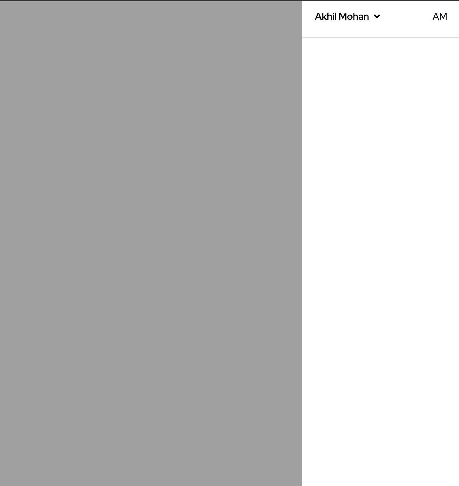
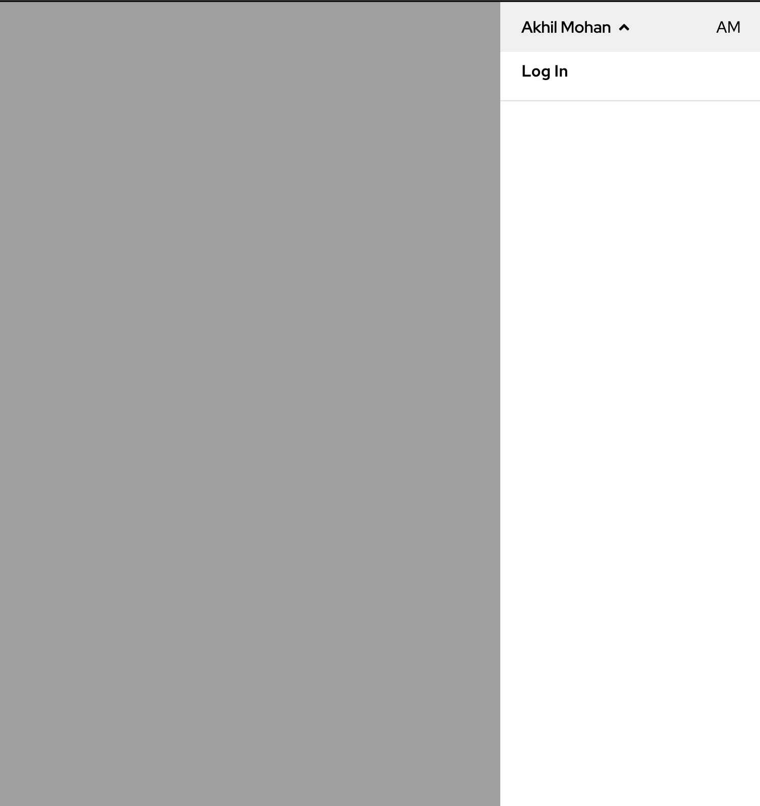
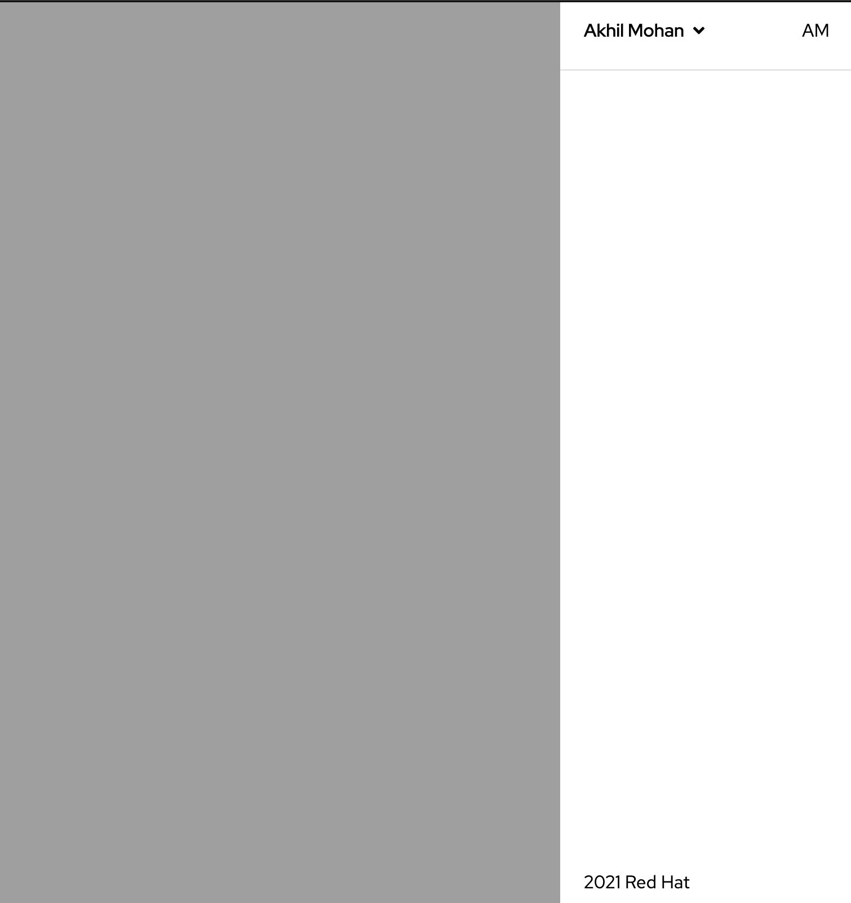

# opc-menu-drawer Component 👋


[](https://github.com/1-Platform/op-components/graphs/commit-activity)

Opc-menu-drawer is a webcomponent developed using Lit elements for Red Hat One Platform. It's a customizable drawer component that contains header, menu buttons, links.

## Prerequisites

Opc-menu-drawer is implemented under Red Hat design guidelines. Therefore the component uses Red Hat official font. This can be easily imported with google cdn at the top of HTML document.

```html
<link rel="preconnect" href="https://fonts.googleapis.com" />
<link rel="preconnect" href="https://fonts.gstatic.com" crossorigin />
<link
  href="https://fonts.googleapis.com/css2?family=Red+Hat+Display&display=swap"
  rel="stylesheet"
/>
<link
  href="https://fonts.googleapis.com/css2?family=Red+Hat+Text&display=swap"
  rel="stylesheet"
/>
```

## Guidelines

Opc-menu-drawer contains mainly two component. A backdrop and a drawer component expanded from rightside of the screen. The drawer can be controlled using `isOpen` attribute. Backdrop color can be controlled by `--opc-menu-drawer__backdrop-color` css variable.

<!-- 1. opc-menu-drawer with header -->

<details>
<summary>opc-menu-drawer with header</summary>

## Details

The header is the topmost element seen on the drawer body. It contains a collapsable box with a title from the attribute `headerTitle` and an optional slot `avatar` to provide an avatar of the user. The header also accepts buttons through the slot `menu` that provide primary actions of the drawer, which is revealed by expanding the header title. The header container could be replaced with the slot `header`.

### Code

```html
<opc-menu-drawer headerTitle="Akhil Mohan">
  <span slot="avatar">AM</span>
  <button slot="menu">Log In</button>
</opc-menu-drawer>
```

```js
document.querySelector('opc-menu-drawer').open();
```

### Screenshot

#### opc-menu-drawer with header collapsed



#### opc-menu-drawer with header expanded



</details>

<!-- 2. opc-menu-drawer with links -->

<details>
<summary>opc-menu-drawer with links</summary>

## Details

The drawer component accepts links grouped into categories for users to navigate easily. Links can be set via the `links` attribute. When the links are more than 5 for a group, the rest of them will be hidden in a collapsable box. It can be revealed by clicking on the show more button for that category.

The default slot gets passed to the drawer body. It will be shown after the links section if links are provided.

### Code

```html
<opc-menu-drawer headerTitle="Akhil Mohan">
  <span slot="avatar">AM</span>
  <div>
    <h6>Main Body</h6>
  </div>
</opc-menu-drawer>
```

```js
const links = [
  {
    title: 'BUILD IN SERVICES',
    links: [
      { name: 'Blog', href: '#' },
      { name: 'Documentation', href: '#' },
      { name: 'Something #1', href: '#' },
      { name: 'Something #2', href: '#' },
      { name: 'Something #3', href: '#' },
      { name: 'Something #4', href: '#' },
      { name: 'Something #5', href: '#' },
      { name: 'Something #6', href: '#' },
    ],
  },
  {
    title: 'BUILD IN SERVICES',
    links: [
      { name: 'blog', href: '#' },
      { name: 'Documentation', href: '#' },
    ],
  },
];

document.querySelector('opc-menu-drawer').links = links;
document.querySelector('opc-menu-drawer').open();
```

### Screenshot

#### opc-menu-drawer with links


</details>

<!-- 3. opc-menu-drawer with footer -->

<details>
<summary>opc-menu-drawer with footer</summary>

## Details

The footer component will be at the bottom of the drawer body. It can be added using the slot `footer`. When the contents of the drawer cause overflow, the footer will be at the bottom.

### Code

```html
<opc-menu-drawer headerTitle="Akhil Mohan">
  <span slot="avatar">AM</span>
  <span slot="footer">2021 Red Hat </span>
</opc-menu-drawer>
```

```js
document.querySelector('opc-menu-drawer').open();
```

### Screenshot

#### opc-menu-drawer with footer



</details>

## Slots

There are total 5 slots available in this component

- `Default slot`: Default slot will be component inside body of the drawer componenent.

- `header`: Container component that contains the header component.

- `avatar`: The avatar component on drawer header.

- `menu`: The menu button on expanding drawer header.

- `footer`: Footer component of the drawer body.

## Attributes

- `links`
  - Type: `Array`
  - Default value: [ ]

```js
document.querySelector("opc-menu-drawer").links = {
    title: "BUILD in SERVICES",
    links: [
      { name: "Blog#2", href: "#" },
      { name: "Documentation#1", href: "#" },
    ],
  },;
```

- `headerTitle`
  - Type: `String`
  - Default value: `''`

```html
  <opc-menu-drawer headerTitle="Akhil Mohan"></opc-menu-drawer isOpen>
```

### Methods

- `isOpen`
  - Type: `Boolean`
  - Default value: `false`

```js
document.querySelector('opc-menu-drawer').isOpen;
```

- `open`
  - Description: To open the drawer.

```js
document.querySelector('opc-menu-drawer').open();
```

- `close`
  - Description: To close the drawer.

```js
document.querySelector('opc-menu-drawer').close();
```

- `toggle`
  - Description: To toggle the drawer states.

```js
document.querySelector('opc-menu-drawer').toggle();
```

## Events

There are two events emitted by opc-menu-drawer emitter when drawer state changes.

1. `opc-menu-drawer:open`

Dispatched when drawer opens.

Example:

```js
document
  .querySelector('opc-menu-drawer')
  .addEventListener('opc-menu-drawer:open', function (event) {
    alert('drawer opened');
  });
```

1. `opc-menu-drawer:close`

Dispatched when drawer closed.

Example:

```js
document
  .querySelector('opc-menu-drawer')
  .addEventListener('opc-menu-drawer:close', function (event) {
    alert('drawer closed');
  });
```

# CSS Variables

| CSS Variable name                           | Value             |
| ------------------------------------------- | ----------------- |
| `--opc-menu-drawer__backdrop-color`         | #00000060         |
| `--opc-menu-drawer__btn-hover-color`        | #efefef           |
| `--opc-menu-drawer__z-index`                | 9                 |
| ` --opc-menu-drawer__width`                 | 260px             |
| `--opc-menu-drawer__top`                    | 0px               |
| `--opc-menu-drawer__right`                  | #000              |
| `--opc-menu-drawer__menu-padding`           | 8px 21px          |
| `--opc-menu-drawer__link-group-title-color` | #6a6e73           |
| `--opc-menu-drawer__transition--default`    | 120ms ease-in-out |

## Install

```sh
npm install
```

## Usage

### Install opc-menu-drawer

```sh
npm install --save @one-platform/opc-menu-drawer
```

### For VanillaJS

- Import component

```js
import '@one-platform/opc-menu-drawer/dist/opc-menu-drawer';
```

- Add component in html

```html
<opc-menu-drawer> </opc-menu-drawer>
```

### For Angular

- In your app.module include the `CUSTOM_ELEMENTS_SCHEMA` and import the component

```js
import { NgModule, CUSTOM_ELEMENTS_SCHEMA } from '@angular/core';
import '@one-platform/opc-menu-drawer/dist/opc-menu-drawer';

@NgModule({
  declarations: [AppComponent],
  imports: [BrowserModule],
  schemas: [CUSTOM_ELEMENTS_SCHEMA],
  providers: [],
  bootstrap: [AppComponent],
})
export class AppModule {}
```

- Add component in any component html template

```html
<opc-menu-drawer> </opc-menu-drawer>
```

### For React

- Import the component in App.js

```js
import '@one-platform/opc-menu-drawer/dist/opc-menu-drawer';
```

- Add component in any component html render

```html
<opc-menu-drawer> </opc-menu-drawer>
```

### Development server

- Run development server

```sh
npm run dev opc-menu-drawer
```

### Build

```sh
npm run build opc-menu-drawer
```

## Run tests

```sh
npm run test
```

## 🤝 Contributors

👤 **[akhilmhdh](https://github.com/akhilmhdh)**
