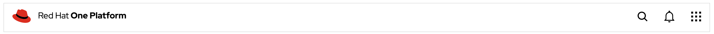
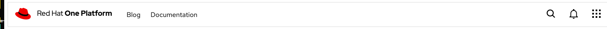
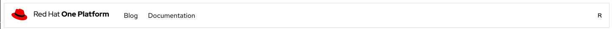

# opc-nav Component 👋


[](https://github.com/1-Platform/op-components/graphs/commit-activity)

Opc-Nav is a fully customizable web component developed using Lit elements for Red Hat One Platform. Its primarily used as the navigation bar that contains links, menu buttons, and logo.

## Prerequisites

Opc-Nav is implement under Red Hat design guidelines. Therefore the component uses Red Hat official font. This can be easily imported with google cdn at the top of HTML document.

```html
<link rel="preconnect" href="https://fonts.googleapis.com" />
<link rel="preconnect" href="https://fonts.gstatic.com" crossorigin />
<link
  href="https://fonts.googleapis.com/css2?family=Red+Hat+Display&display=swap"
  rel="stylesheet"
/>
<link
  href="https://fonts.googleapis.com/css2?family=Red+Hat+Text&display=swap"
  rel="stylesheet"
/>
```

## Guidelines

<!-- 1. opc-nav with logo -->

<details>
<summary>opc-nav with logo</summary>

## Details

It is a mandatory slot component that contains the product logo, positioned at the left extreme. The best component would be an image component. The height of the image must be within `60px`, which is the height of the navbar. It can be changed with the CSS variable `--opc-nav-height`.

### Code

```html
<opc-nav>
  
  <opc-nav-search slot="opc-nav-search"></opc-nav-search>
</opc-nav>
```

### Screenshot



</details>

<!-- 2. opc-nav with links -->
<details>
<summary>opc-nav with links</summary>

## Details

Links are the quick reference links for easy navigation, positioned after the logo along the middle. By default, it could be added with the `links` attribute. We can also customize the entire links by using slot `opc-nav-menu-links`. This will replace the entire links component container.

### Code

```html
<opc-nav>
  
  <opc-nav-search slot="opc-nav-search"></opc-nav-search>
</opc-nav>
```

```js
const links = [
  { name: 'Blog', href: '#' },
  { name: 'Documentation', href: '#' },
];
document.querySelector('opc-nav').links = links;
```

### Screenshot



</details>

<!-- 3. opc-nav with buttons -->
<details>
<summary>opc-nav with nav buttons</summary>

## Details

The nav buttons, enable utility actions that enhance the user experience. By default, opc-nav provides two buttons with there corresponding events. Menu buttons can be replaced with the slot `opc-nav-btn`. Icon buttons with size of 60px are prefered. `activeMenu` property provides active class styling to show users which one is selected. It accepts `menu | notification` as value.

| Name                | Icon      | Event                          |
| ------------------- | --------- | ------------------------------ |
| Notification Button | Bell Icon | opc-nav-btn-notification:click |
| Menu Button         | Grid Icon | opc-nav-btn-menu:click         |

### Code (Default)

```html
<opc-nav>
  
  <opc-nav-search slot="opc-nav-search"></opc-nav-search>
</opc-nav>
```

### Screenshot



### Code (Search hidden and custom button)

```html
<opc-nav>
  
  <button slot="opc-nav-btn">R</button>
</opc-nav>
```

### Screenshot


</details>

<details>
<summary>opc-nav-search</summary>

## Details

`opc-nav-search` is a search component for the `opc-nav`. It enables modular control on how the search works. It has events `opc-nav-search:change` on input change and `opc-nav-search:search` on search submit.

### Code (Default)

```html
<opc-nav>
  <opc-nav-search slot="opc-nav-search"></opc-nav-search>
</opc-nav>
```

```js
document
  .querySelector('opc-nav-search')
  .addEventListener('opc-nav-search:change', function (event) {
    console.log(event.detail.value);
  });
document
  .querySelector('opc-nav-search')
  .addEventListener('opc-nav-search:submit', function (event) {
    console.log(event.detail.value);
  });
```

</details>

## Slots

<!-- Add Slots here -->

There are total 4 slots of which 3 are optional and one is mandatory

### Mandatory Slots

- `opc-nav-logo`: To set the logo of the application in navbar. Suggested component would be an ``

### Optional Slots

- `opc-nav-menu-links`: Container component that contains various nav links. If not given and `links` attribute will be shown.

- `opc-nav-search`: Container component that contains the search component.

- `opc-nav-btn`: The buttons at end of the navbar used for various actions. If not provided by default `Notification Bell Button` and `Menu Button` will be shown with corresponding events.

## Attributes

### opc-nav

- `links`
  - Type: `Array`
  - Default value: [ ]

```js
document.querySelector('opc-nav').links = [{ name: 'Blog', href: '#' }];
```

- `activeButton`
  - Type: `menu | notification`
  - Default value: null

```js
document.querySelector('opc-nav').activeMenu = 'menu';
```

### opc-nav-search

- `value`
  - Type: `String`
  - Default value: `""`

```js
document.querySelector('opc-nav-search').value = 'Search';
```

- `placeholder`
  - Type: `String`
  - Default value: `Search application, documents, contents etc`

```js
document.querySelector('opc-nav-search').placeholder = 'Search';
```

## Events

### opc-nav

There are two events emitted by opc-nav both are dispatched on click of navbar notification(bell icon) and menu(grid icon) button.

1. `opc-nav-btn-menu:click`

Dispatched on menu(grid icon) button click.

Example:

```js
document
  .querySelector('opc-nav')
  .addEventListener('opc-nav-btn-menu:click', function (event) {
    alert('menu got clicked');
  });
```

2. `opc-nav-btn-notification:click`

Dispatched on notification(bell icon) button click.

Example:

```js
document
  .querySelector('opc-nav')
  .addEventListener('opc-nav-btn-notification:click', function (event) {
    alert('notification got clicked');
  });
```

### opc-nav-search

1. `opc-nav-search:change`

Dispatched on input change of search.

Example:

```js
document
  .querySelector('opc-nav-search')
  .addEventListener('opc-nav-search:change', function (event) {
    console.log(event.detail.value);
  });
```

2. `opc-nav-btn-notification:click`

Dispatched on notification(bell icon) button click.

Example:

```js
document
  .querySelector('opc-nav')
  .addEventListener('opc-nav-search:submit', function (event) {
    alert(event.detail.value);
  });
```

## CSS Variables

### opc-nav

| CSS Variable name               | Value             |
| ------------------------------- | ----------------- |
| `--opc-nav-height`              | 60px              |
| `--opc-nav-width`               | 100%              |
| `--opc-nav-position-top`        | 0                 |
| `--opc-nav-position-left`       | 0                 |
| `--opc-nav-transition--defaul`  | 120ms ease-in-out |
| `--opc-nav-menu__spacing-size`  | 24px              |
| `--opc-nav-menu__link-color`    | #151515           |
| ` --opc-nav-container__z-index` | 9                 |
| `--opc-nav-btn__padding`        | 16px              |
| `--opc-nav-display`             | block             |
| `--opc-nav-btn__hover-color`    | #316dc11a         |
| `--opc-nav-link__hover-color`   | #0066cc           |

### opc-nav-search

| CSS Variable name                 | Value     |
| --------------------------------- | --------- |
| `--opc-nav-search-bg`             | #f3f3f3   |
| `--opc-nav-search__padding`       | 12px 17px |
| `--opc-nav-search__border-radius` | 8px       |

## Install

```sh
npm install
```

## Usage

### Install opc-nav

```sh
npm install --save @one-platform/opc-nav
```

### For VanillaJS

- Import component

```js
import '@one-platform/opc-nav/dist/opc-nav';
```

- Add component in html

```html
<opc-nav> </opc-nav>
```

### For Angular

- In your app.module include the `CUSTOM_ELEMENTS_SCHEMA` and import the component

```js
import { NgModule, CUSTOM_ELEMENTS_SCHEMA } from '@angular/core';
import '@one-platform/opc-nav/dist/opc-nav';

@NgModule({
  declarations: [AppComponent],
  imports: [BrowserModule],
  schemas: [CUSTOM_ELEMENTS_SCHEMA],
  providers: [],
  bootstrap: [AppComponent],
})
export class AppModule {}
```

- Add component in any component html template

```html
<opc-nav> </opc-nav>
```

### For React

- Import the component in App.js

```js
import '@one-platform/opc-nav/dist/opc-nav';
```

- Add component in any component html render

```html
<opc-nav> </opc-nav>
```

### Development server

- Run development server

```sh
npm run dev opc-nav
```

### Build

```sh
npm run build opc-nav
```

## Run tests

```sh
npm run test
```

## 🤝 Contributors

👤 **[akhilmhdh](https://github.com/akhilmhdh)**
