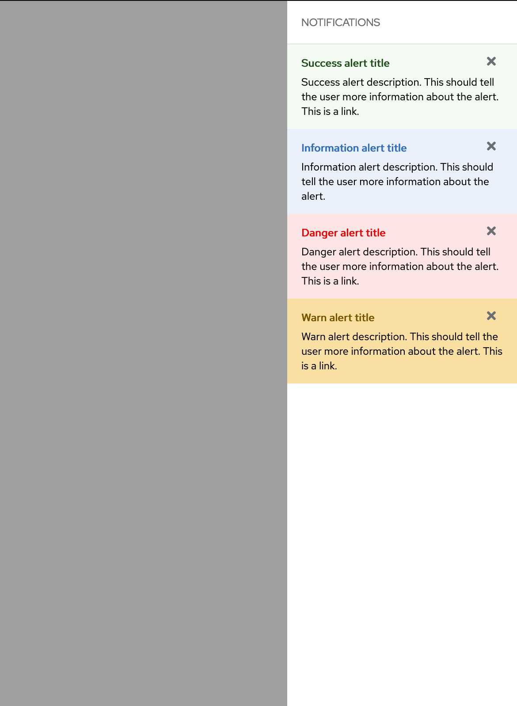

# opc-notification-drawer Component 👋


[](https://github.com/1-Platform/op-components/graphs/commit-activity)

Opc-Notification-drawer is a special drawer web component developed using Lit elements for the Red Hat One Platform. It's used for providing notification lists to users.

## Prerequisites

Opc-Notification-drawer is implement under Red Hat design guidelines. Therefore the component uses Red Hat official font. This can be easily imported with google cdn at the top of HTML document.

```html
<link rel="preconnect" href="https://fonts.googleapis.com" />
<link rel="preconnect" href="https://fonts.gstatic.com" crossorigin />
<link
  href="https://fonts.googleapis.com/css2?family=Red+Hat+Display&display=swap"
  rel="stylesheet"
/>
<link
  href="https://fonts.googleapis.com/css2?family=Red+Hat+Text&display=swap"
  rel="stylesheet"
/>
```

## Guidelines

Opc-notification-drawer contains two components.

- `opc-notification-drawer`: It's a simple drawer component, as a container for notifications.

- `opc-notification-item`: A customizable notification component that has styles based on variants of success, danger, warn.

<!-- 1. opc-notification-drawer-->

<details>
<summary>opc-notification-drawer with opc-notification-item</summary>

## Details

It's drawer container component to contain all notifications required for the user. By using the default slot users can render there own custom Notification items. There is also a slot `opc-notification__header-menu` to provide drawer action menu like filter button.

Opc-notification-drawer component also provides `opc-notification-item` component that provides styling with multiple variants. It can be used inside `opc-notification-drawer` to avoid overhead of custom styled component. The component accept a `key` attribute which should be unique amoung list to identify the closed one.

### Code

```html
<opc-notification-drawer>
  <opc-notification-item
    title="Success alert title"
    variant="success"
    key="notification1"
  >
    <span
      >Success alert description. This should tell the user more information
      about the alert. This is a link.</span
    >
  </opc-notification-item>
  <opc-notification-item title="Information alert title" variant="info">
    <span
      >Information alert description. This should tell the user more information
      about the alert.</span
    >
  </opc-notification-item>
  <opc-notification-item title="Danger alert title" variant="danger">
    <span
      >Danger alert description. This should tell the user more information
      about the alert. This is a link.</span
    >
  </opc-notification-item>
  <opc-notification-item title="Warn alert title" variant="warn">
    <span
      >Warn alert description. This should tell the user more information about
      the alert. This is a link.</span
    >
  </opc-notification-item>
</opc-notification-drawer>
```

```js
document.querySelector('opc-notification-drawer').open();
```

### Screenshot



</details>

## Slots

### opc-notification-drawer

- `default slot`: The body of opc-notification-drawer component.

- `header` : Container component for the header that contains title and menu buttons.

- `header-menu`: Menu buttons for the drawer on right to title.

- `footer`: Footer component of the drawer.

### opc-notification-item

- `default slot`: The contents inside the notification item

- `header` : Container component for the header that contains notification title and close button.

- `header-actions`:Container component of the menu actions of the notification.

## Attributes

### opc-notification-drawer

- `title`
  - Type: `String`
  - Default value: `notifications`

```html
<opc-notification-drawer title="messages"></opc-notification-drawer>
```

### Methods

- `isOpen`
  - Type: `Boolean`
  - Default value: `false`

```js
document.querySelector('opc-notification-drawer').isOpen;
```

- `open`
  - Description: To open the drawer.

```js
document.querySelector('opc-notification-drawer').open();
```

- `close`
  - Description: To close the drawer.

```js
document.querySelector('opc-notification-drawer').close();
```

- `toggle`
  - Description: To toggle the drawer states.

```js
document.querySelector('opc-notification-drawer').toggle();
```

### opc-notification-item

- `variant`
  - Type: `'success'| 'info' | 'danger' | 'warn' `
  - Default value: `info`

```html
<opc-notification-item variant="success"></opc-notification-item>
```

- `title`
  - Type: `String`
  - Default value: ``

```html
<opc-notification-item title="Success message"></opc-notification-item>
```

- `key`
  - Type: `String`

```html
<opc-notification-drawer key="notification#1"></opc-notification-drawer>
```

## Events

### opc-notification-drawer

There are two events emitted by opc-notification-drawer emitter when drawer state changes.

1. `opc-notification-drawer:open`

Dispatched when drawer opens.

Example:

```js
document
  .querySelector('opc-notification-drawer')
  .addEventListener('opc-notification-drawer:open', function (event) {
    alert('drawer opened');
  });
```

1. `opc-notification-drawer:close`

Dispatched when drawer closed.

Example:

```js
document
  .querySelector('opc-notification-drawer')
  .addEventListener('opc-notification-drawer:close', function (event) {
    alert('drawer closed');
  });
```

### opc-notification-item

1. `opc-notification-item:close`

Dispatched on clicking close button. It contains the payload of `{ key:string, title: string,}`

Example:

```js
document
  .querySelector('opc-notification-item')
  .addEventListener('opc-notification-item:close', (e) => {
    alert(JSON.stringify(e.detail));
  });
```

## CSS Variables

| CSS Variable name                                  | Value             |
| -------------------------------------------------- | ----------------- |
| `--opc-notification-drawer__backdrop-color`        | #00000060         |
| `--opc-notification-drawer__z-index`               | 9                 |
| ` --opc-notification-drawer__width`                | 260px             |
| `--opc-notification-drawer__top`                   | 0px               |
| `--opc-notification-drawer__right`                 | #000              |
| `--opc-notification-drawer__transition--default`   | 120ms ease-in-out |
| `--opc-notification-item__variant--success`        | #f2faf2           |
| `--opc-notification-item__variant--success-header` | #1e4f18           |
| `--opc-notification-item__variant--danger`         | #ee00001a         |
| `--opc-notification-item__variant--danger-header`  | #ee0000           |
| `--opc-notification-item__variant--info`           | #316dc11a         |
| `--opc-notification-item__variant--info-header`    | #316dc1           |
| `--opc-notification-item__variant--warn`           | #f9e0a2           |
| `--opc-notification-item__variant--warn-header`    | #795600           |

## Themes/Variants

### opc-notification-item

| color   | hex       |
| ------- | --------- |
| success | #f2faf2   |
| danger  | #ee00001a |
| info    | #316dc11a |
| warn    | #f9e0a2   |

## Install

```sh
npm install
```

## Usage

### Install opc-notification-drawer

```sh
npm install --save @one-platform/opc-notification-drawer
```

### For VanillaJS

- Import component

```js
import '@one-platform/opc-notification-drawer/dist/opc-notification-drawer';
```

- Add component in html

```html
<opc-notification-drawer> </opc-notification-drawer>
```

### For Angular

- In your app.module include the `CUSTOM_ELEMENTS_SCHEMA` and import the component

```js
import { NgModule, CUSTOM_ELEMENTS_SCHEMA } from '@angular/core';
import '@one-platform/opc-notification-drawer/dist/opc-notification-drawer';

@NgModule({
  declarations: [AppComponent],
  imports: [BrowserModule],
  schemas: [CUSTOM_ELEMENTS_SCHEMA],
  providers: [],
  bootstrap: [AppComponent],
})
export class AppModule {}
```

- Add component in any component html template

```html
<opc-notification-drawer> </opc-notification-drawer>
```

### For React

- Import the component in App.js

```js
import '@one-platform/opc-notification-drawer/dist/opc-notification-drawer';
```

- Add component in any component html render

```html
<opc-notification-drawer> </opc-notification-drawer>
```

### Development server

- Run development server

```sh
npm run dev opc-notification-drawer
```

### Build

```sh
npm run build opc-notification-drawer
```

## Run tests

```sh
npm run test
```

## 🤝 Contributors

👤 **[akhilmhdh](https://github.com/akhilmhdh)**
